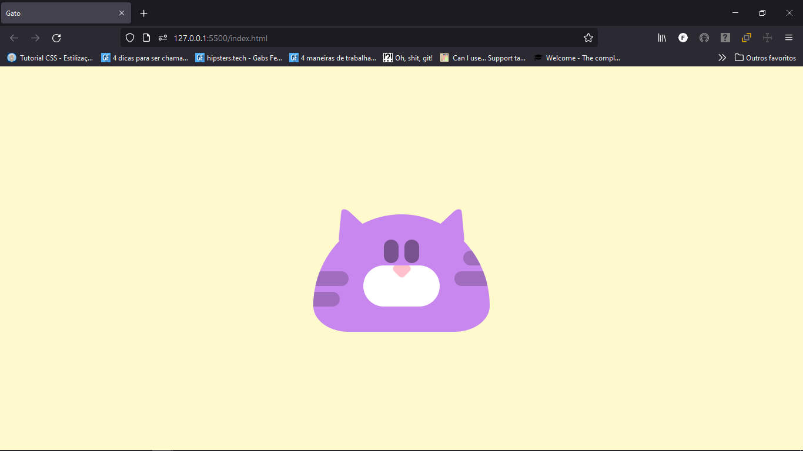

<h1 align="center">Desenho de gato fofo e rosa</h1>

<h2 align="center">Mais uma vez, uma obra de arte da Natália Dev: https://www.youtube.com/watch?v=uuFDzlzRTYg</h2>

<h3>Tecnologias utilizadas:</h3>

- HTML
- CSS (Várias vezes utilizando pseudo-classe before e after). <strong>Com certeza irei estudar essas pseudo classes maravilhosas!</strong>

